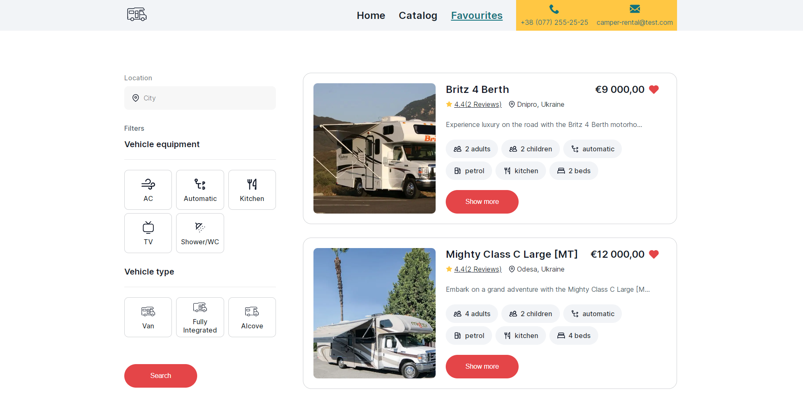
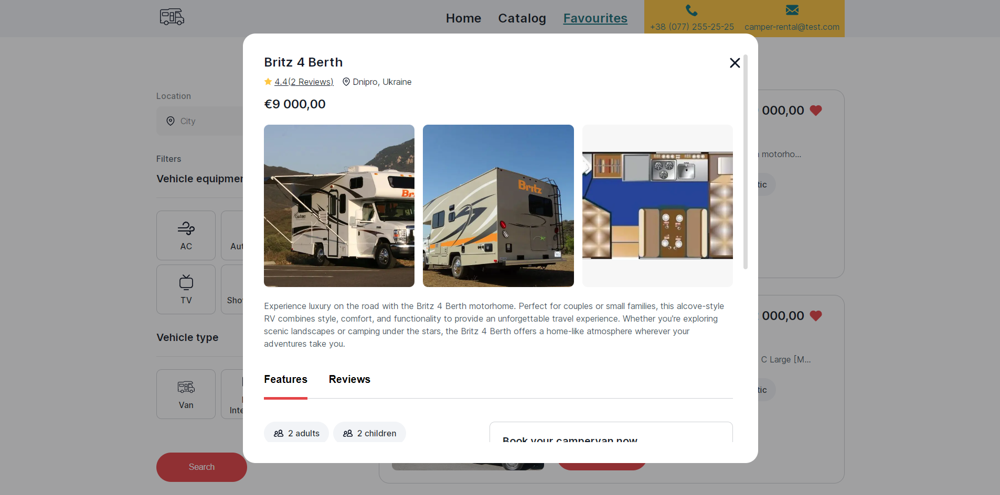
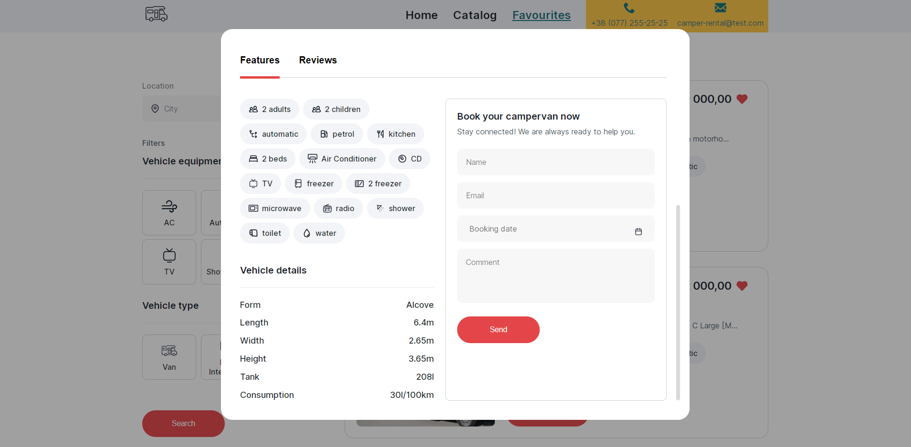

## Application for a company providing camper rental services in Ukraine

Click link: [Camper rentals](https://valerii2022.github.io/camper-rent/).

## For start use command:

### `npm start`

Runs the app in the development mode.\
Open [http://localhost:3000](http://localhost:3000) to view it in your browser.

The page will reload when you make changes.\
You may also see any lint errors in the console.

## Technology Stack:

&nbsp;
&nbsp;
&nbsp;
&nbsp;
&nbsp;
&nbsp;
&nbsp;
&nbsp;

## The application consists of 3 pages:

`«Homepage»` with a general description of the services provided by the company.

`«Catalog»` of available campers of various configurations, which the user can
filter by location, equipment and type.

`«Favorites»` - a page with adverts that have been added to the user favourites
list.

If you click on the button in the form of `«Heart»` on the card, the ad is added
to the list of `«Favorites»`, and the color of the button changes.

When the page is updated, the final result of the user's actions is recorded.
That is, if you add an ad to `«Favorites»` and refresh the page, the button
still remains in the `«Favorites ad»` state with the appropriate color. If you
click the `«Heart»` button again, the ad is removed from the list of
`«Favorites»`, and the color of the button changes to its original state.

### Announcement card with detailed information about the camper, characteristics, reviews has been implemented.

Clicking on the `«Show more»` button opens a modal window with detailed
information about the camper.

 

The modal window is closed by clicking on the button in the form of a `«cross»`,
by clicking on the `«backdrop»` or pressing the `«ESC»` key.

#### Load more

The first page of the catalog displays 4 adverts, and the rest of them - on
clicking the 'Load more' button.

#### Book camper

The user can fill out a form with information about himself inside the modal
window and book a camper for the selected date. Name, email and booking date
inputs have validation.

