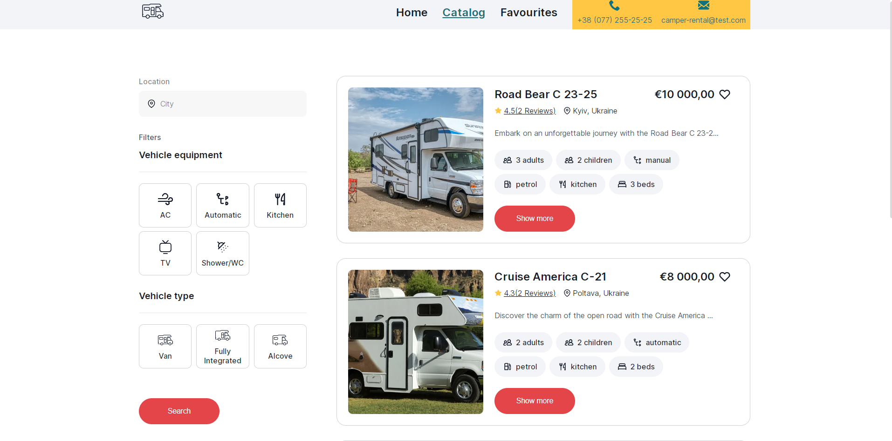
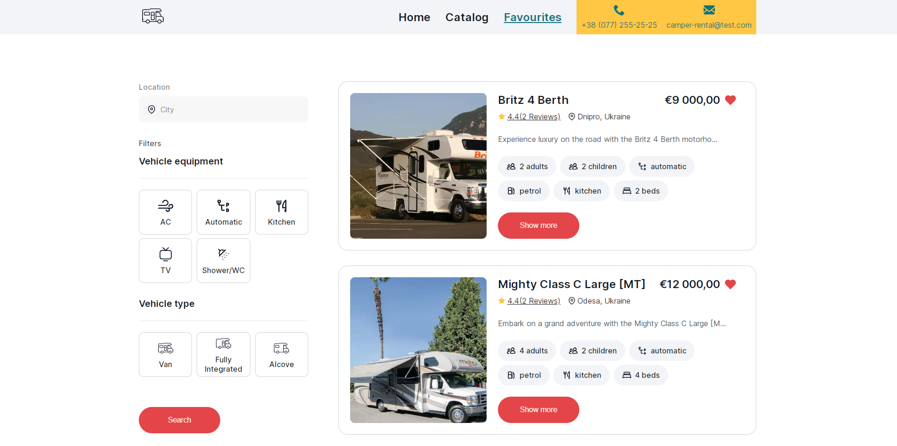
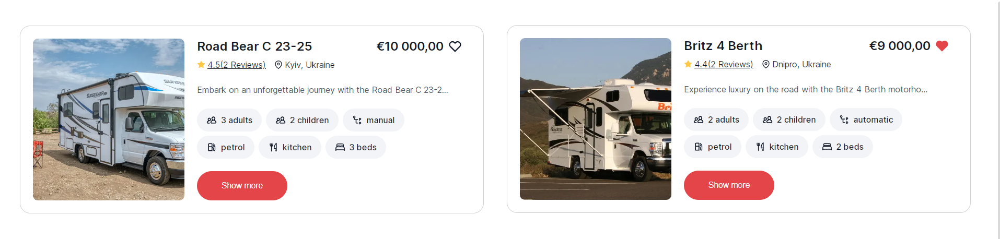
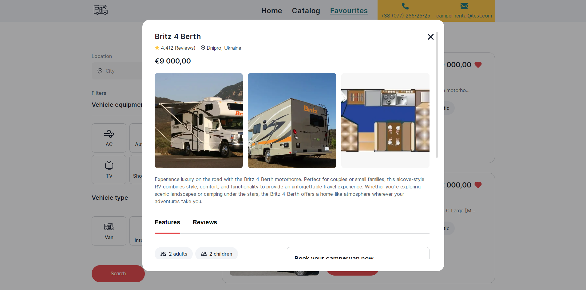

# Застосунок для оренди автомобілів в Україні.

## Застосунок складається з 3-х сторінок:

`«Домашня сторінка»` з загальним описом послуг, що надає компанія.

`«Каталог»` автівок різної комплектації, які користувач може фільтрувати за
маркою, ціною за годину оренди авто та кількістю кілометрів, яку подолав
автомобіль під час його експлуатації (пробіг).

Сторінка з оголошеннями, які були додані користувачем в `«Улюблені»`.

У разі кліку по кнопці у вигляді `«Серця»` на картці оголошення додається до
списку `«Улюблених»`, а колір кнопки змінюється.

При оновленні сторінки фіксується кінцевий результат дій користувача. Тобто,
якщо додати оголошення в `«Улюблені»` та оновити сторінку - то кнопка все одно
залишається в стані `«Улюбленого оголошення»` із відповідним кольором. У разі
повторного кліку по кнопці у вигляді `«Серця»` оголошення видаляється зі списку
`«Улюблених»`, а колір кнопки змінюється до початкового стану.

### Реалізована картка оголошення про здачу авто в оренду з інформацією про автомобіль.

При натисканні на кнопку `«Learn more»` відкривається модальне вікно з детальною
інформацією про автомобіль та умовами оренди.

Модальне вікно закривається по кліку на кнопку у вигляді `«хрестика»`, по кліку
на `«backdrop»` або натисканню на клавішу `«ESC»`. Кнопку `«Rental car»` надає
можливість користувачу зʼєднатись з компанією за номером телефону
`«+380730000000»`.

### Реалізована можливість фільтрації оголошень за `«брендом»` автомобіля, `«ціною»` за годину оренди та за `«пробігом»` авто.

